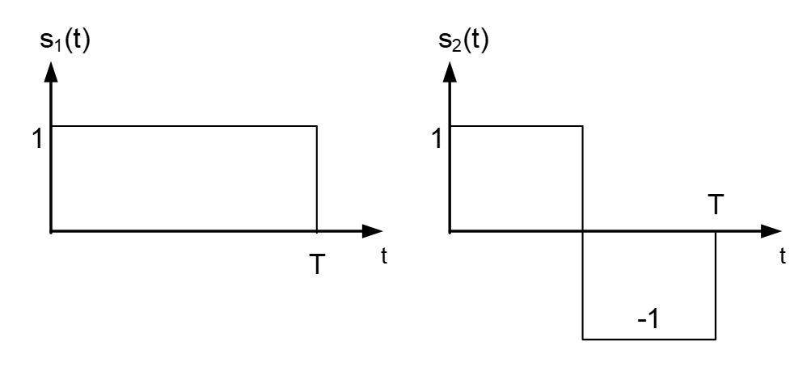
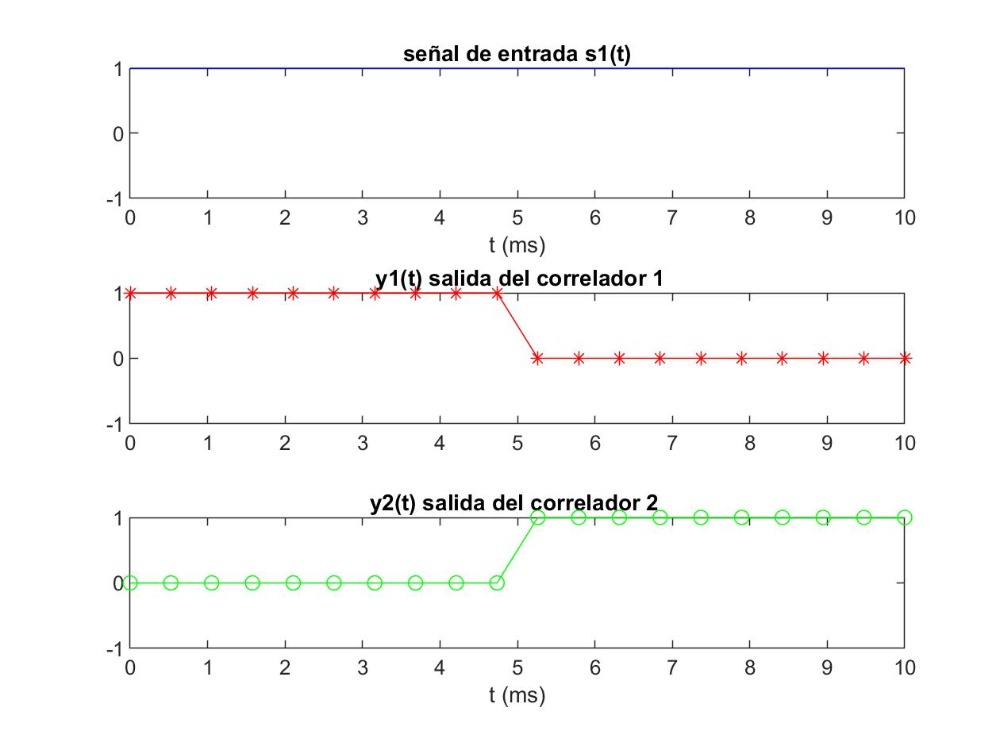
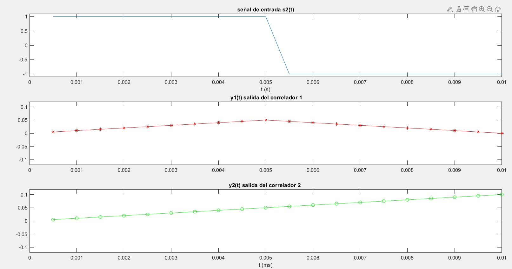
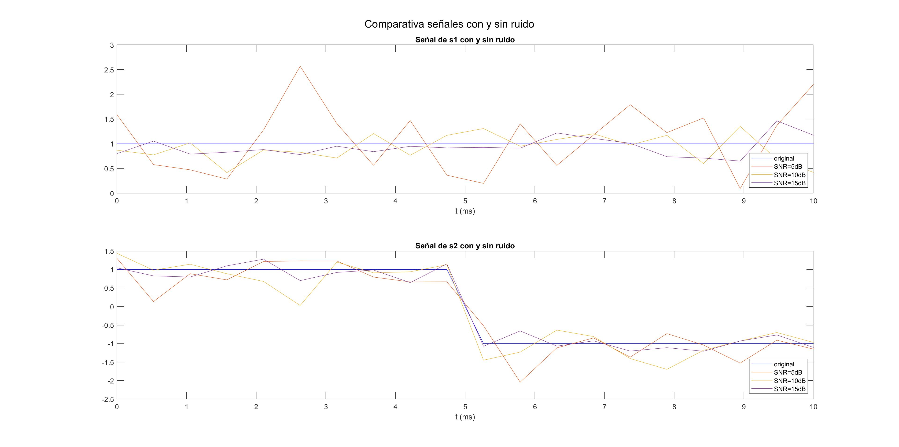
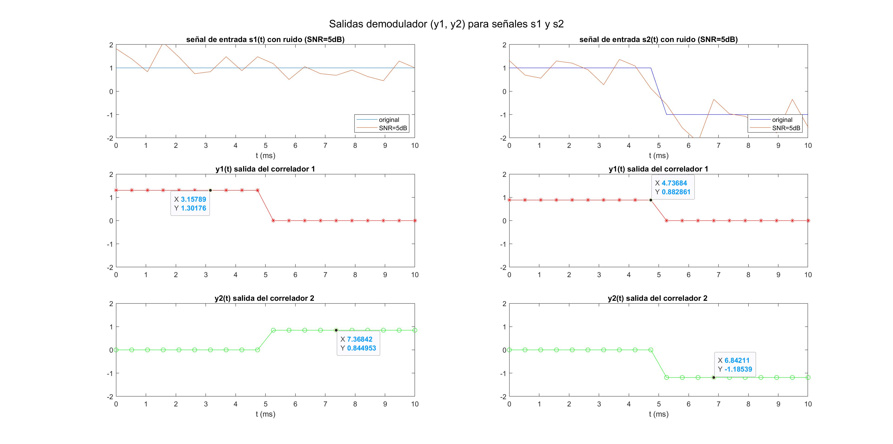
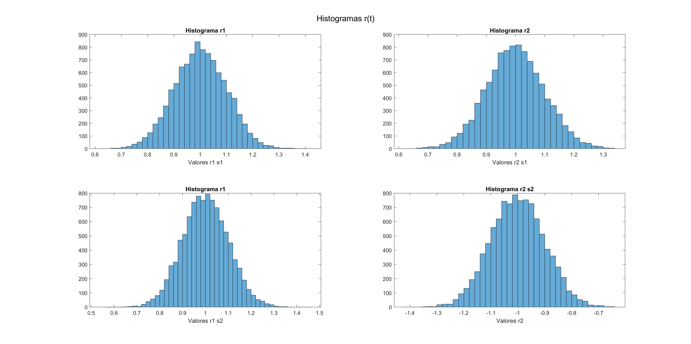

# PRÁCTICA 1 - Demodulación Digital en Banda Base

Autores:
* *David Cocero Quintanilla*  
* *David Egea Hernández*

---
El objetivo de esta primera práctica es diferentes técnicas de demodulación de señales digitales estudiadas en teoría. Además se analizará el efecto de la presencia de ruido en el canal. 

En nuestro caso, hemos optado por desarrollar un demodulador por correlación. 

Las señales `s1` y `s2` que utilizadas en esta práctica son las siguientes:

## 2. Demodulador de un símbol
---

Esta parte se centra en el desarrollo e implementación del demodulador por correlación. 

### Ejercicio 2.1
---
Representación temporal del vector de salida de ambos correladores para los dos posibles símbolos recibidos (i.e. s1 y s2). Es decir, los valores de y_n (t) para n = 1,¿Son los resultados lógicos? Coméntelos. Quizá sea una buena idea utilizar la función subplot para presentar los resultados. Asegúrese de que todas las gráficas tienen los mismos ejes para facilitar la comparación.
   
Vemos que para el simbolo s1 y1(t) vale 1 y y2(t) desde 0 hasta T/2. Desde T/2 hasta T, será lo contrario, con y1(t) valiendo 0 y y2(t) valiendo 1.

Estos resultados tienen sentido ya que como la señal no tiene nada de ruido los coeficientes para s1 serán 1 para ambas bases.

Para el simbolo s2 y1(t) vale 1 y y2(t) desde 0 hasta T/2 al igual que s1. Sin embargo, desde T/2 hasta T, y1(t) estará en 0 y y2(t) valdrá -1.

De nuevo al no haber ruido los coeficientes para s2 serán -1 y 1.Asegúrese

¿Cuál sería el instante temporal idóneo para hacer el muestreo y enviar la señal al detector?

Lo mejor sería hacer el muestreo en el punto medio, de esta forma se pueden evitar posibles problemas de ISI (Interferencia entre símbolos). En nuestro caso el muestreo se debería hacer para t= T/4 para la primera base y t= 3T/4 para la segun  

---
### Ejercicio 2.2

En este segundo ejercicio se introduce ruido blanco gaussiano a la señal. Recordemos que este tipo de ruido se caractiza por la distribución uniforme de su potencia en todo el espectro de frecuencias. 

Para añadir el ruido a la señal hemos empleado la función `awgn` que ofrece la [*Communications Toolbox*](https://es.mathworks.com/products/communications.html) de MATLAB 

Aquí vemos una comparación de cómo el ruido afecta a los simbolos s1 y s2 para distintos valores de SNR. En este caso veremos qué sucede en el caso de usar 5,10 y 15 dB de SNR.

En la primera imagen se ve s1 original junto con sus modificaciones por el ruido y en la segunda aparece s2 con sus variantes. Se puede apreciar como 10 y 15 dB no afectan tanto pero con 5 dB la señal se distorsiona considerablemente. Aún así los picos de la señal no varian lo suficiente para que el detector  tene problemas confundiendose de simbolo entre s1 y s2. Por ello en este apartado seleccionaremos 5dB de SNR, ya que será el modo de transmisión más barato que sigue siendo correcto.

Abajo aparecen representadas las salidas de los 2 demoduladores para s1 (primera columna) y s2 (segunda columna)

Vemos que ahora el ruido hace que los coeficientes a la salida de los demoduladores no sean enteros. Para s1, y1 estará entorno a 1.3 mientras que y2 está sobre el 0.85. Con s2 ocurrirá lo mismo, aunque se desvían menos con y1 valiendo 0.88 y y2 -1.18.

De todas formas, aunque los coeficientes no salgan enteros, el detector aproximará al simbolo más cercano por lo que la transmisión será correcta.

## 3. Salida del demodulador 
---

En este caso seguiremos con el mismo nivel de 5dB SNR para el ruido blanco que añadimos. Este se debe a que es el minimo SNR que se permite sin que haya errores de transmisión.

Además elegiremos un valor de Nsymb de 1000 para poder representar bien los histogramas.

Generamos los histogramas de la figura de abajo, con la salida de los demoduladores para s1 en la primera columna y para s2 en la segunda.

Los cuatro histogramas parecen tener una distribución gausiana, con media en el valor real de los coeficientes: [1 1] para s1 y [1 -1] para s2. Estos resultados parecen correctos ya que el ruido blanco gaussiano tiene distribución gaussiana, así que a partir de un numero de muestras adecuado (1000 en nuestro caso), los histogramas tendrán una distribución similar.
