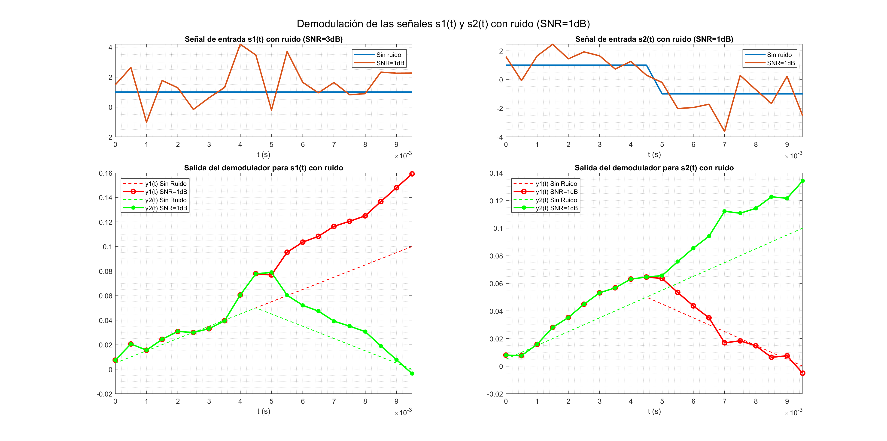

Sistemas de Comunicación I
# PRÁCTICA 1 - Demodulación Digital en Banda Base

Autores:
* *David Cocero Quintanilla*  
* *David Egea Hernández*
---
El objetivo de esta primera práctica es diferentes técnicas de demodulación de señales digitales estudiadas en teoría. Además se analizará el efecto de la presencia de ruido en el canal. 

En nuestro caso, hemos optado por desarrollar un demodulador por correlación. 

Las señales `s1` y `s2` que utilizadas en esta práctica son las siguientes:

Para codificar estos simbolos, hemos utilizado las siguientes bases ortonormales:

$$ϕ_1 (t)={(s1 (t)) \over √T}$$
$$ϕ_2 (t)={(s2 (t)) \over √T}$$

Teniendo en cuenta estas bases, los coeficientes para los simbolos s1 y s2 son:

$$s1= \sqrt T *[1,0]$$       
$$s2= \sqrt T *[0,1]$$ 

## 2. Demodulador de un símbolo

Esta parte se centra en la implementación del demodulador por correlación. 

> Esta parte se desarrolla en la sección `2. Demodulador de un símbolo - Ejercicio 2.1` del *script** principal `main.m`. Adicionalmente, se ha generado la función del demodulador por correlación en `correlatorType.m`.

### Ejercicio 2.1
---
***Representación temporal del vector de salida de ambos correladores para los dos posibles símbolos recibidos (i.e. s1 y s2). Es decir, los valores de y_n (t) para n = 1,¿Son los resultados lógicos? Coméntelos. Quizá sea una buena idea utilizar la función subplot para presentar los resultados. Asegúrese de que todas las gráficas tienen los mismos ejes para facilitar la comparación.***
   
Para el símbolo s1, la salida del demodulador de phi1 subirá de forma constante hasta llegar a su valor final de 0.1 y la salida del demodulador de phi2 sube hasta la mitad del periodo y desde ahí baja hasta el cero. Este resultado tiene sentido ya que como hemos comentado, los coeficientes de s1 son $\sqrt T= \sqrt 0.01=0.1$ y 0 respectivamente, que se corresponden con los valores finales de los demoduladores.

Análogamente, para el simbolo s2, la salida del demodulador de phi1 subirá hasta T/2 para despues bajar a cero y la salida del demodulador de phi2 subirá durante todo el periodo hasta 0.1. También es un resultado lógico ya que los coeficientes de s2 son 0 y $\sqrt T= \sqrt 0.01=0.1$ , idénticos a la muestra final de las salidas de los demoduladores.

***¿Cuál sería el instante temporal idóneo para hacer el muestreo y enviar la señal al detector?***

Lo mejor sería hacer el muestreo en el punto final, ya que en este punto se hace la integral durante todo el periodo. Si vemos las salidas de los demoduladores, estas  suben o bajan hasta llegar al coeficiente real en la **última muestra**.  

---
### Ejercicio 2.2

> Este ejercio se encuentra en la sección `2. Demodulador de un símbolo - Ejercicio 2.2` en el script principal `main.m`

En este segundo ejercicio se introduce ruido blanco gaussiano a la señal. Recordemos que este tipo de ruido se caractiza por la distribución uniforme de su potencia en todo el espectro de frecuencias. 

Para añadir el ruido a la señal hemos empleado la función `awgn` que ofrece la [*Communications Toolbox*](https://es.mathworks.com/products/communications.html) de MATLAB 

Aquí vemos una comparación de cómo el ruido afecta a los simbolos s1 y s2 para distintos valores de SNR. En este caso veremos qué sucede en el caso de usar 1, 3 y 5 dB de SNR.

En primer caso de las señales con SNR de 1dB es posible comprobar como la variación con respecto a las señales sin ruido es muy notable (gráficas superiores). La salida de los demoduladores difiere en gran medida en comparación con el caso ideal (en discontinua), especialmente para el caso del coeficiente no nulo (y1 para s1 e y2 para s2). 

En segundo lugar, las señales con SNR de 3dB difieren en menor medida en comparación con los casos anteriores (1dB). Por este motivo, las gráficas de evolución de los coeficientes de la demodulación se aproximan más a las originales (sin ruido). 

En tercer lugar, las señales con SNR de 5dB son las que mejores resultados arrojan, como era de esperar al tener una menor proporción de ruido. 

Cabe destacar que en todos los casos analizados es posible comprobar como existe una tendencia en la salidad de los demoduladores hacia unos ciertos valores. Estos valores son los coeficientes relativos a las bases ortonormales que fueron calculados teóricamente con anterioridad **([0.1 y 0] para s1(t) y [0 y 0.1] para s2(t))**. Como se ha mencionado antes, cuanto mayor es la SNR mayor es la aproximación de la salida a dichos valores. 

## 3. Salida del demodulador 

> Este ejercio se encuentra en la sección `3. Salida del demodulador - Ejercicio 3.1` en el script principal `main.m`

Ahora, en este apartado se ha pruebado la transmisión de 10000 símbolos, almacenando la última muestra de la salida de los demoduladores para cada símbolo. Para ello, se muestrea el vector de evolución de los coeficientes del demodulador en los instantes n*T, siendo *n* un número entero y *T* el período de símbolo. 

Para los tres niveles de SNR ya analizados en el anterior ejercicio, se han representado los histogramas de los valores obtenidos de los coeficientes. En todos los casos, se aprecia como las distribuciones están centradas en 0 y 0.1, valores correspondientes con los coeficientes ideales de los símbolos. Sin embargo, como las señales introducidas no son ideales, los valores se encuentran siguiendo una distribución gaussiana, por ser el ruido introducido *ruido blanco gaussiano*.

En el caso de `SNR = 1db`, se puede apreciar que las colas de ambas distribuciones se solapan entorno a *0.05*. Los valores que se encuentran en esta región pueden llegar a ser identificados incorrectamente por el detector. Utilizar este nivel de señal-ruido implica asumir una cierta tasa de error de símbolo no despreciable. 

Como se muestra en la gráfica del caso de `SNR = 3db`, las distribuciones parecen encontrarse demasiado próximas, ocurriendo un solapamiento mínimo en sus colas. 

Finalmente, el caso de `SNR = 5db` muestra que este nivel de señal-ruido parece ser suficiente para evitar el indeseado solapamiento, al encontrarse ambas distribuiones lo suficientemente espaciadas entre sí. 

