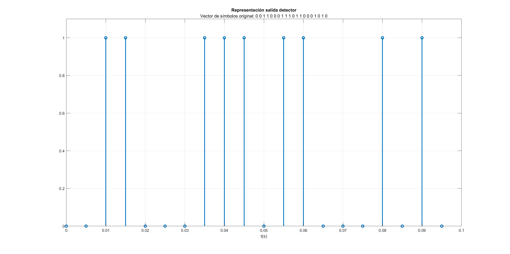

Sistemas de Comunicación I
# PRÁCTICA 2 - Detección Digital en Banda Base

Autores:
* *David Cocero Quintanilla*  
* *David Egea Hernández*

---

## 1. Introducción

Los archivos desarrollados en esta práctica:
- `Modulador.m`

## 2. Modulador

El bloque correspondiente al demodulador digital en banda base se encarga de construir señales moduladas que varían en el tiempo en función de ciertos símbolos de entrada. Los símbolos de entrada se combinan linealmente con ciertas bases ortogonales para dar lugar a las señales moduladas.

Para las bases ortonormales phi1 y phi2 los coeficientes de las bases son: 
s1= [1 0]  s2=[0 1] s3=[-1 0] s4= [0 -1]

# Ejercicio 2.1

# Ejercicio 3.1

# Ejercicio 4.1

# Ejercicio 5.1

