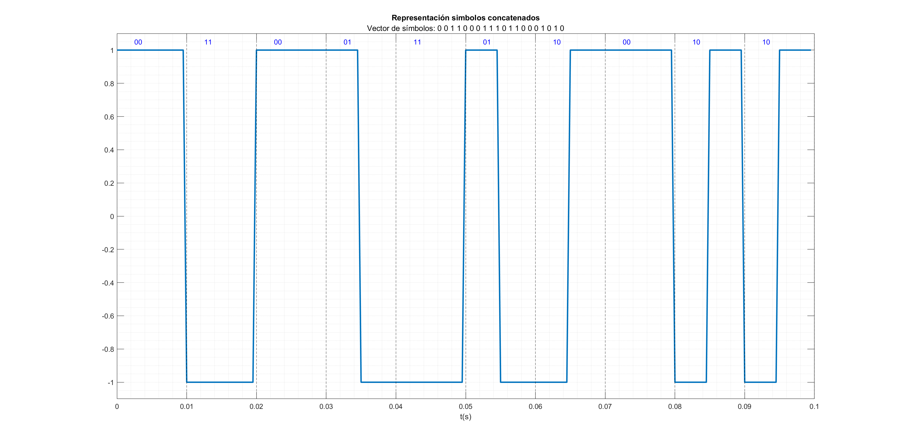
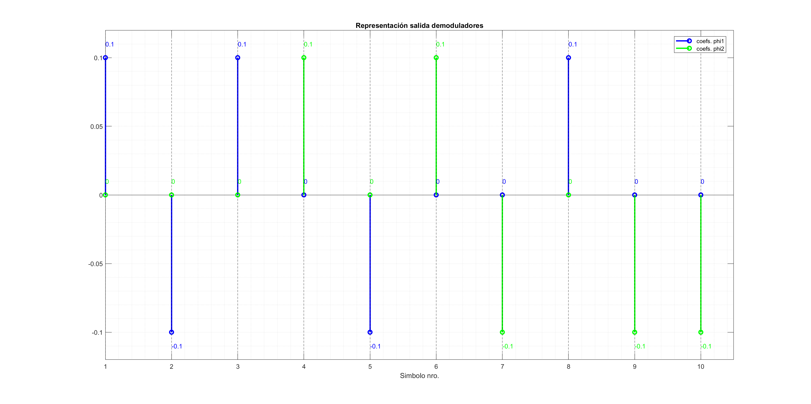

Sistemas de Comunicación I
# PRÁCTICA 2 - Detección Digital en Banda Base

Autores:
* *David Cocero Quintanilla*  
* *David Egea Hernández*

---

# 1. Introducción


Los archivos desarrollados en esta práctica:
- `modulador.m`
- `demodulador.m`
- `detector.m`
- `coeffs.m`

Además utilizaremos el archivo `correlatorType.m`, desarrollado en la práctica 1.


# 2. Modulador

El bloque correspondiente al demodulador digital en banda base se encarga de construir señales moduladas que varían en el tiempo en función de ciertos símbolos de entrada. Los símbolos de entrada se combinan linealmente con ciertas bases ortogonales para dar lugar a las señales moduladas.


Para las bases ortonormales phi1 y phi2 los coeficientes de las bases son: 

s1= $A\sqrt T$ [1 0]       
s2= $A\sqrt T$ [0 1]  
s3= $A\sqrt T$ [-1 0]  
s4= $A\sqrt T$ [0 -1]  

## Ejercicio 2.1

> La implentación del modulador utilizado en este ejercicio se encuentra en el àrchivo `modulador`.m.  

La función `modulador` genera un vector de muestras producto de la concatenación de los distintos símbolos del sistema {*s1,s2,s3,s4*}.

Para la selección de los símbolos se crea un vector pseudoaleatorio de ceros y unos, que se pasa como argumento al modulador. En el caso de la práctica como hay cuatro señales básicas ha sido necesario emplear dos bits para codificar cada símbolo. 

En cuanto a la codificación, se ha optado por el uso de *códigos binarios reflejados* o *códigos Gray*. Está técnica es especialmente interesante por que minimiza la probabilidad de error al aplicarse la propiedad de que símbolos consecutivos solo difieren en un único bit. Los códigos son los siguientes:

    cods1 = [0 0] , cods2 = [0 1]  
    cods3 = [1 1] , cods4 = [1 0]

Por otra parte, para lograr el *array* de bits pseudoaleatorio de entrada se puede utilizar la siguiente expresión en MATLAB:

```MATLAB
% Generación de un vector pseudoaleatorio (N=10)
r = randi([0,1],1,2*N); 
```
El resultado de la modulación es:



Se puede observar como la modulación se ha realizado correctamente, y que el vector de símbolos introducidos se han traducido en las correspondiente concatenación de señales. 

# 3. Demodulador

El demodulador recibe como entrada la señal de los símbolos concatenados y devuelve los vectores de salida de los dos demoduladores muestrados en k·T, k=1...N, siendo N el número de símbolos.

## Ejercicio 3.1

En nuestro diseño se irá recorriendo el vector de entrada y se llamará a la función `correlatorType.m` pasandole cada vez las 20 muestras correspondientes a un símbolo. Para cada uno de los dos vectores que devuelve la función cogeremos la última muestra. Con estos valores se llenarán dos vectores de longitud N, uno para cada demodulador, que es lo que devuelve el bloque.




# 4. Detector

El detector recibe los vectores de salida del detector y, basándose en esos valores, decide qué símbolo es más probable que fuera transmitido.

## Ejercicio 4.1
 
En este caso para cada simbolo que recibimos juntamos las salidas de los dos demoduladores en una tupla. Luego calculamos la distancia de esta tupla a los coeficientes de cada uno de los cuatro símbolos  (tomando la norma euclidea del vector diferencia). Finalmente, seleccionamos el símbolo que resulte en la menor distancia y lo añadimos a s_hat.

Este es el resultado de una de las pruebas realizadas. Se muestra la gráfica de la salida del detector y arriba aparece el vector de simbolos que se mando originalmente.


Se aprecia como los resultados son lógicos y el componente funciona a la perfección

# Probabilidad de error

## Ejercicio 5.1

En la siguiente figura se representan 3 gráficas. La primera representa la probabilidad de error por simbolo obtenida con nuestro sistema de modulador, demodulador y detector. La siguiente también representa la probabilidad de error por simbolo pero en este caso teórica, siguiendo la fórmula

 $$ Pe = Q({ \sqrt {2*log_{2}M* EbNo}* sin({\pi \over m})})$$

 Por último tendremos el Bit Error Rate (BER), que es la probabilidad de error teórica pero en este caso por bit. Se calculará dividiendo la formula de antes entre $log_{2}M$ donde M es el numero de simbolos distintos, en este caso 4.

--Poner nueva imagen Probabilidad error


Obviamente, con mayor nivel SNR, la probabilidad de error disminuirá en todos los casos. Si prestamos un poco de atención vemos como la teórica y la simulada están muy parejas,con el BER valiendo siempre la mitad de la teórica. Esta similitud se debe a que como se transmite un número grande de símbolos, el rendimiento de nuestro sistema en cuanto a errores será similar a lo calculado. 

Además, obtenemos estos resultados porque hemos elegido el código Gray para codificar los simbolos (00 para S1, 01 para S2, 11 para S3 y 10 para S4) que minimiza el ratio de errores. Por ejemplo, si codificaramos los símbolos de otra forma (00 para S1, 01 para S2, 10 para S3 y 11 para S4) vemos en la siguiente gráfica que nuestra probabilidad de error de simbolo es ahora mayor que la teórica.


