Sistemas de Comunicación I
# PRÁCTICA 3 - Interferencia entre Símbolos

Autores:
* *David Cocero Quintanilla*  
* *David Egea Hernández*

---

# 1. Respuesta impulsional y en frecuencia de varios filtros 

En este apartado se analiza el comportamiento de cuatro filtros paso bajo diferentes.

### **1. Comente la bondad relativa de los cuatro filtros para la transmisión en banda base en función de los criterios que estime conveniente.**

La respuesta impulsional de los filtros puede expresarse como una función de seno cardinal o *sinc*:

$sinc(x)=\frac {sin(\pi*x)}{\pi x}$

La propiedad principal de esta expresión matemática es que la función toma valor cero en los instantes $n*T$, siendo *n* es un número entero y *T* el período de la señal. 

La primera observación que se extrae de la gráfica anterior es que a mayor factor de *roll-off* (α) de un filtro, mayor es la velocidad a la que decaen las colas de su respuesta impulsional. Esto queda demostrado en el filtro de α=1 (filtro de coseno alzado), cuyas colas son de una magnitud significativamente inferior a las del resto de filtros. 

Por otro lado, es posible determinar si un filtro posee ISI en base a su respuesta impulsional, identificando si su función asociada toma valor cero en todos los puntos k*T, para cualquier entero *k*. Debido a esto, en caso de que un filtro no tome un valor nulo en alguno de estos instantes, es razonable afirmar que está ocurriendo distorsión. 

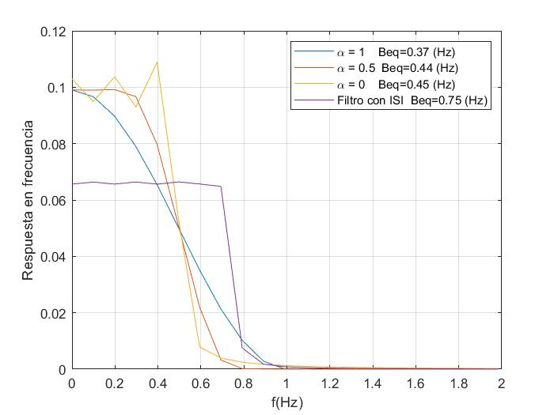

Sobre la respuesta en frecuencia, se observa en la gráfica superior que cada uno de los cuatro filtros posee un comportamiento espectral claramente distinto del resto. A continuación, se han analizado individualmente cada uno de ellos, comentando los resultados obtenidos acerca de la banda de paso, transición y rechazo. 

Comenzando por la **banda de paso**: 
- Filtro α=0 (ideal): Posee una banda de paso marcada por el rizado, producto de la inviabilidad de recrear un filtro perfectamente ideal en MATLAB. 
- Filtro α=0.5: Cuenta con una región de paso es estable, sin rizado aparente. 
- Filtro α=1 (coseno alzado perfecto): Tiene una banda de paso estrecha que decae prontamente. Esto puede suponer un problema para el filtrado de señales con un ancho de banda más grande, ya que puede llegar a atenuar significativamente la región de mayor frecuencia de la señal. 
- Filtro con ISI: Presenta una banda de paso amplia y con un rizado mínimo, que sin embargo, está marcada por la atenuación uniforme (0.65) que introduce el filtro. Esto se traduce en una pérdida significativa de la potencia espectral de la señal que se desea filtrar. 

Sobre la **banda de transición**: 
- Filtro α=0 (ideal): Como la pendiente de la banda de transición es la más pronunciada, este filtro posee la banda de rechazo más cercana en frecuencia. En un filtro completamente ideal (irrealizable), esta pendiende sería completamente vertical. La frecuecia límite de este filtro se encuentra en 0.4 Hz. 
- Filtro α=0.5: La pendiente en este caso es menor que la del filtro ideal, pero sigue siendo mejor que la del α=1
- Filtro α=1 (coseno alzado perfecto): A pesar de que esta banda empieza pronto, la pendiente es menos acusada
- Filtro con ISI: Presenta una pendiente abrupta, de forma que el filtro alcanza rápidamente la banda de rechazo. 

Sobre la **banda de rechazo**:
- Filtro α=0 : Es el filtro con la banda de rechazo más temprana, ya que podría considerarse que comienza a partir de 0.6 Hz. 
- Filtro α=0.5: Similar al caso anterior, solo que comienza a partir de 0.7 Hz.
- Filtro α=1 (coseno alzado perfecto): Entorno a 0.8Hz.
- Filtro con ISI: Muestra un comportamiento parecido al del filtro α=1 en esta región.

Teniendo en cuenta estos resultados, descartaremos de primeras el filtro con ISI, ya que la banda de paso sale bastante atenuada. Además, como hemos comentado antes, en la respuesta temporal se aprecia como habrá interferencia entre simbolos ya que la función asociada no toma valor cero en los instantes k*T.

Por otro lado,el filtro de α=0 también lo podemos descartar por su acusado rizado en la banda de paso. Además en la respuesta temporal las oscilaciones que aparecen a los lados son demasiado grandes, lo que puede acarrear problemas en la transmisión.

Si hubiera que elegir uno entre los dos filtros restantes, probablemente elegiremos el de factor de *roll-off* de 0.5 ya que es un buen compromiso

### **2. Comente los resultados de las gráficas 1 y 2. A la vista de lo que está programado, ¿qué es el ancho de banda equivalente de ruido de los filtros?**

El ancho de banda equivalente de ruido es el ancho de banda de un filtro ideal rectangular que daría el mismo valor de ruido cuadrático medio (la misma potencia normalizada de ruido) en la salida frente a un ruido blanco en la entrada.

Se calcula haciendo la integral de la respuesta en frequencia del filtro al cuadrado entre 2 y despues se normaliza. 

# 2.	Estudio del ISI sin ruido por medio de diagramas de ojo

### **3.	Comente las Figuras 3, 4 y 5.**

En la primera Figura 3 se observa un vector de muestras generadas aleatoriamente, que ha sido centrado en su propia secuencia. 

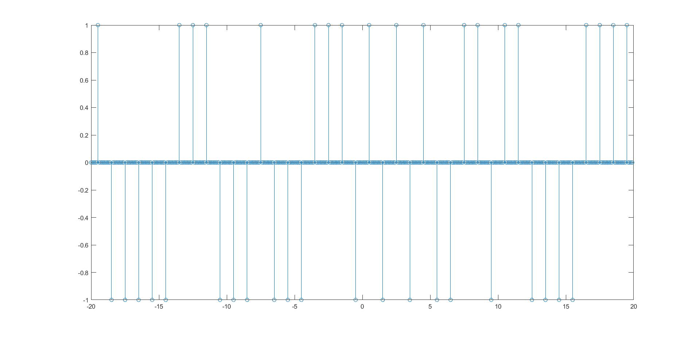

La Figura 4 muestra la salida de los cuatro filtros al vector de muestras de la anterior figura. Se puede comprobar como, por efecto de la convolución, los primeros valores reflejados se encuentran retardos 50 muestras (la mitad de longitud del filtro). 

Cuando se produce un único valor, es decir, no se transmite el mismo valor de forma consecutiva durante varias muestras, el filtro de ISI reacciona con un sobreimpulso a dicho valor, superando la amplitud del pulso original introducido. En caso de que sean varias las muestras del mismo valor transmitidas consecutivamente, el filtro de ISI reacciona de forma opuesta. Este efecto contrario se traduce en valores de salida significativamente inferiores a los valores de entrada.  

Con respecto al resto de filtros, el efecto de la sobretensión se manifiesta claramente cuando se envía el mismo símbolo de forma consecutiva, siendo más pronunciado cuanto menor sea el factor de *roll-off* del filtro.

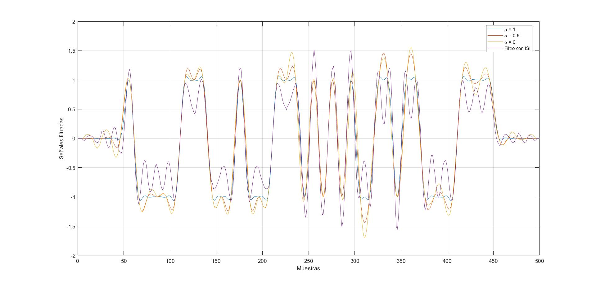

En la Figura 5, se puede ver con mayor claridad el comportamiento analizado, al haber eliminado el retardo introducido por el filtro al inicio y al final de la secuencia. Además se muestra en la figura el vector de entrada utilizado solapado con la respuesta impulsional. De esta forma podemos identificar la respuesta de los filtros para cada simbolo de entrada.

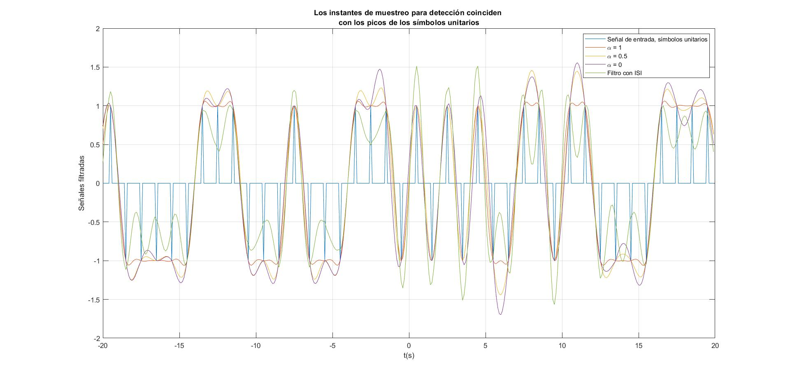

### **4. Relacione los sobreimpulsos con el valor de α. A nivel cualitativo, ¿qué impacto puede tener el sobreimpulso sobre la BER, cuando en lo filtros entra no solamente señal, sino también ruido?**

En el caso que concierne, el efecto del sobreimpulso no supone un peligro ni tiene un afectación directa sobre el BER, al ser un sistema de dos posibles símbolos. En este caso, como la sobretensión añade más amplitud a la señal, es incluso menor probable que se cometa un identificación errónea de un símbolo. 

Sin embargo, para alfabetos mayores, es decir, con una mayor cantidad de símbolos, este efecto si tiene afectación negativa sobre el BER. Al aumentar el nivel de la señal, esta puede llegar a ser confundida como el símbolo siguiente, de modo que la tasa de error aumentará. 

Por otro lado, la existencia de ruido agravará el error cometido por el filtro.

### **5. ¿Cómo se generan los diagramas de ojo?**

Como es bien sabido, los diagramas de ojo se generan mediante la superposión de símbolos sucesivos ajustando temporalmente los intervalos entre los mismos. Típicamente esto se logra introduciendo retardos entre los distintos símbolos, de manera que coincidan todos en el mismo instante.  

Se trata en definitiva de una herramienta para analizar el comportamiento de enlaces de comunicaciones, ya que indican la forma, el nivel de ruido, los desfases y la distorsión de cada sistema. 

Algunos de los factores más relevantes de un diagrama de ojo son:  

* Apertura vertical (amplitud). Es la distancia entre ambos niveles lógicos (1 y-1). Es un indicador de la presencia de ruido o interferencia entre símbolos. 
* Apertura horizontal (tiempo). Es la distancia horizontal entre las pendientes de apertura y cierre, en el nivel del cruce de amplitud (0). 
* Pendiente. Indica la sensibilidad del sistema al error cometido en el restablecimiento del sincronismo en el caso de producirse un error en el instante de muestreo.

### **6. Por inspección sobre las gráficas que se generan, indicar las aperturas de los diagramas de ojo en amplitud y tiempo.**

Para el caso del primer diagrama de ojo, se puede observar como al ser el filtro de α=1, los simbolos superpuestos son muy similares. Además en este caso apenas aparecen sobreimpulsos.Las apertura de amplitud definida anteriormente vale 2 mientras que la de tiempo vale 1.

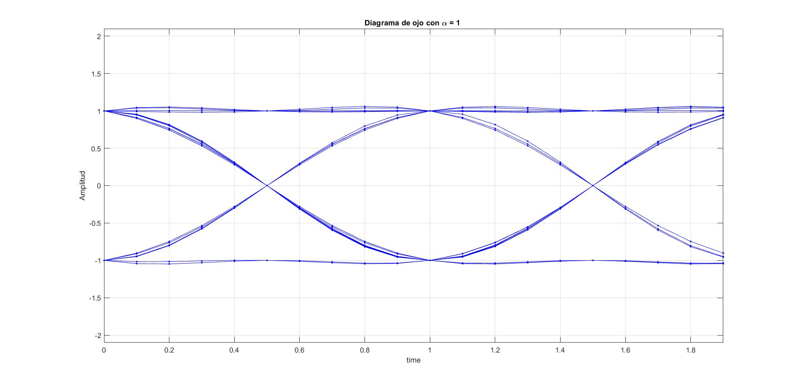

Para α=0.5 vemos que la superposición es más imperfecta, los simbolos en muchos casos no coinciden. Mientras que la apertura vertical del ojo sigue valiendo 2, se puede apreciar como la apertura horizontal del ojo disminuye y pasa a valer entorno a 0.8 segundos.

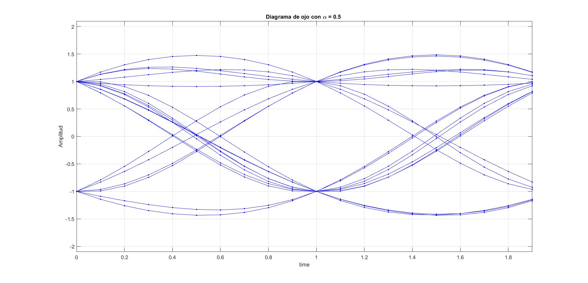

En el caso de α=0 la superposición de símbolos es incluso más imprecisa. Respecto a la apertura, la vertical se sigue manteniendo en 2, pero la horizontal se vuelve a reducir hasta unos 0.6 segundos

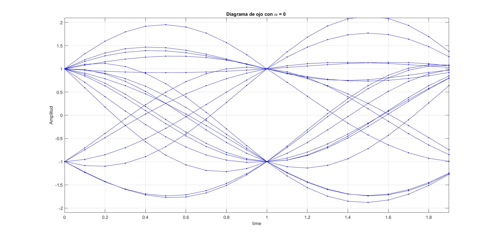

Llegamos finalmente al peor filtro, el que tiene ISI. Aquí el diagrama parece que tiende a cerrarse verticalmente. Al haber distorsión, la apertura vertical será menor de 2, entorno 1.5. Esto significa que existirá interferencias entre símbolos que afectan si tenemos menos apertura vertical, la transmisión será menos resistente al ruido.

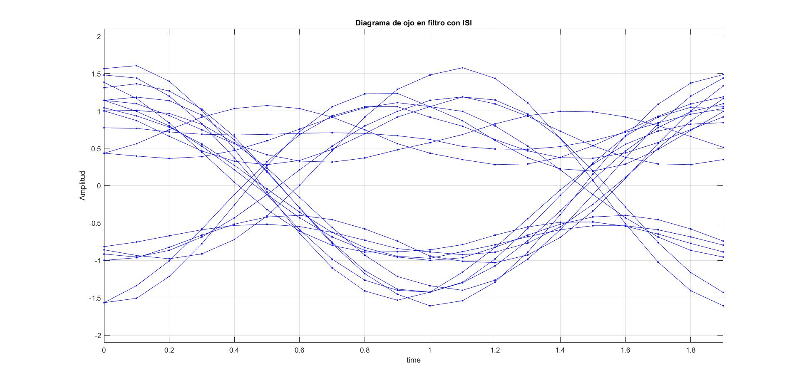

# 3. Efecto del ruido en el diagrama de ojo  

Esta parte de la práctica consiste en comprobar los efectos del ruido en los diagramas de ojo. 

### **7. Indique lo que se realiza en este apartado y los resultados que se obtienen. Realice una comparación entre código y resultados del apartado con los del apartado anterior.**

Típicamente la presencia de ruido blanco gaussiano en la señal de entrada provoca el estrechamiento tanto vertical como horizontal en las aperturas de los diagramas de ojo. Por lo tanto, a mayor ruido, mayor es el impacto de este efecto. 

En primer lugar se ha realizado la prueba para un nivel de SNR de 15dB, obteniéndose los siguientes resultados:

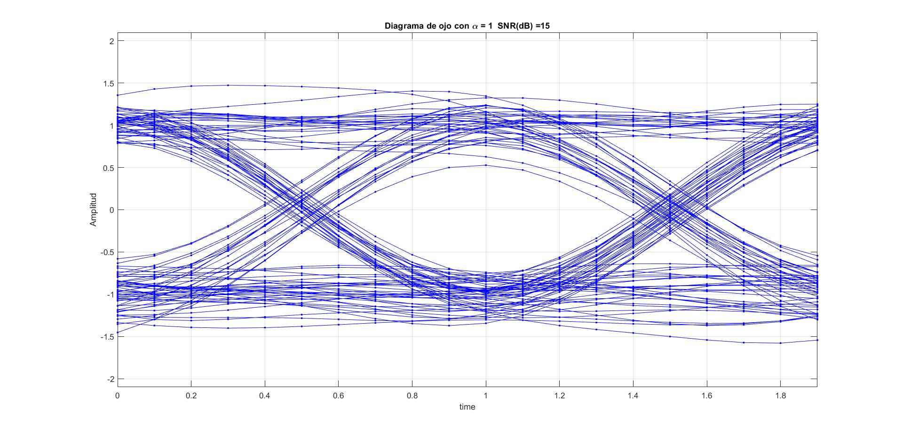  |  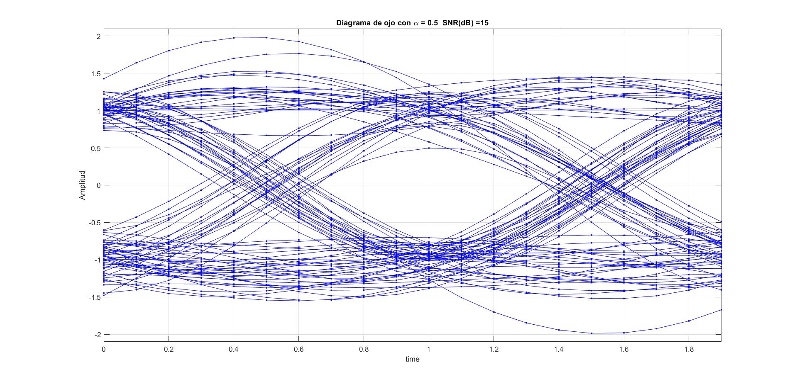 
---| ---
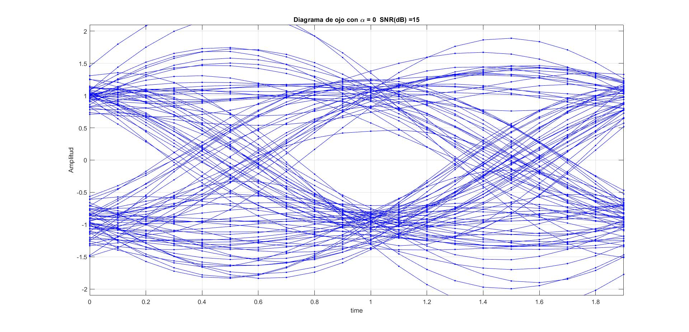 |  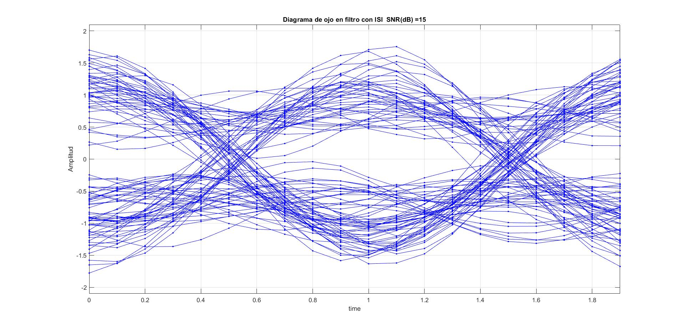

A primera vista, resalta la diferencia con respecto a los resultados obtenidos en el punto 6, ya que como era de esperar, se han reducido las aperturas horizontal y vertical de todos los diagramas de ojo. Además se observa como, por efecto de la presencia de ruido (gaussiano), se ha incrementado la dispersión entre trazos. 

Del mismo modo, se ha realizado la simulación para una SNR de 10dB: 

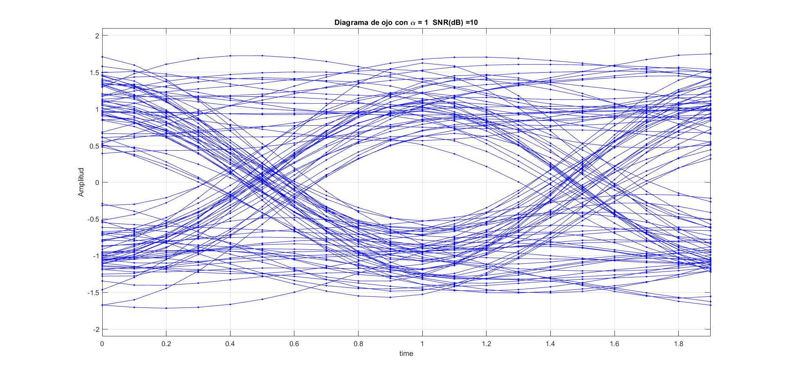  |  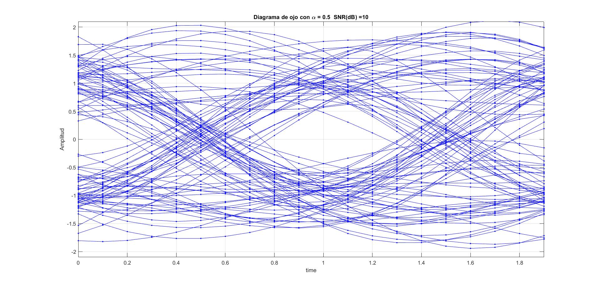 
---| ---
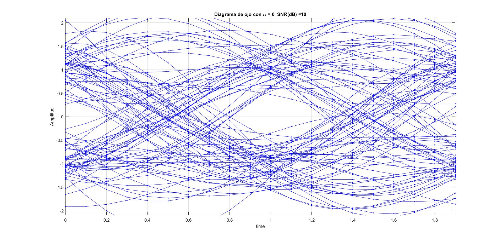 |  

Como estaba previsto, con una SNR menor los símbolos serán menos precisos y los trazos parecen más dispersos. Las conclusiones sobre las aperturas para distintos factores de *roll-off* siguen valiendo, pero en este caso se reducen las aperturas. Esto provocará que haya una mayor tasa de error debido al ruido.

 Con respecto al código generador en MATLAB, vemos que para el anterior apartado simplemente se hacía la convolución de la señal de entrada con el filtro. Ahora utilizaremos la función *salida_filtro* que recibirá la señal de entrada, el filtro y el nivel de SNR deseado. En esta función se añadirá primero el ruido a la señal para después hacer la convolución con el filtro. En ambos casos se recurrirá a la función *diagrama_ojo* para la superposición de simbolos consecutivos y su representación.

 A modo de apunte, cabe destacar que en contraste con los diagramas del anterior apartado, en este caso la cantidad de símbolos generados es mayor, con un total de 200 por diagrama(frente a los 40 de las anteriores gráficas). 

### **8. Razone la relación numérica que debe haber entre la relación señal ruido antes de los filtros con la de después de los filtros.**

En nuestro ejemplo en la entrada de los filtros tenemos nuestra señal más un cierto nivel de ruido (SNR=15). Este ruido se define como ruido blanco gaussiano, con densidad de potencia espectral plana, por lo que los filtros paso bajo eliminarán la parte de este ruido situado en frecuencias altas. La señal por el contrario será en banda base, de forma que no debería perder un nivel significativo de potencia por el filtrado, aún habiendo cierta distorsión. 

Por lo tanto, si la potencia de la señal se mantiene prácticamente estable pero el ruido disminuye considerablemente, la relación señal ruido después de los filtros será mayor.

# 4. Efecto del ISI en la tasa de error 
Este apartado se centra en el análisis de la tasa de error de transmisión obtenida en caso de que la señal de entradahaya sido contaminada con ruido blanco gaussiano.

### **9. Analice los resultados obtenidos en la figura, y relaciónelos con los resultados que apliquen de apartados anteriores.**

Se aprecia que para una determinada SNR el filtro ISI tiene considerablemente más BER. Este resultado era de esperar ya que por supuesto habrá interferencias entre símbolos provocando que ciertos símbolos se identifiquen incorrectamente. Esto se puede relacionar con su diagrama de ojo donde deciamos que la apertura de amplitud era menor que en los otros casos, haciendolo más propenso a errores.

Para los otros filtros, destacamos que cuanto mayor sea el alfa menor es el error de bit para una cierta SNR. Esta conclusión concuerda con lo visto en la series temporales del apartado 2, donde los filtros de menor alfa tenían más sobreimpulsos, lo que lleva a cometer más errores. 

Además en los diagramas de ojo se veía como para los filtros de menor alfa la superposición de símbolos era más imprecisa, llevando a obtener una menor amplitud de tiempo.

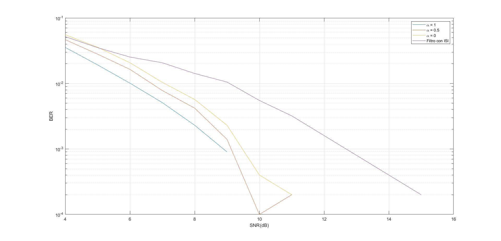

# 5. Efecto del ISI en la tasa de error cuando además de ruido blanco hay error en la elección de los instantes de muestreo

Los filtros han sido diseñados para un cierto tiempo de muestreo de la señal de entrada. En este apartado estudiaremos cómo afecta al BER una mala elección de los instantes de muestreo.

Para ello generaremos una señal de entrada Su muestreada para $1.5 * Ts$ donde *Ts* es el tiempo de muestreo utilizado en el diseño de los filtros

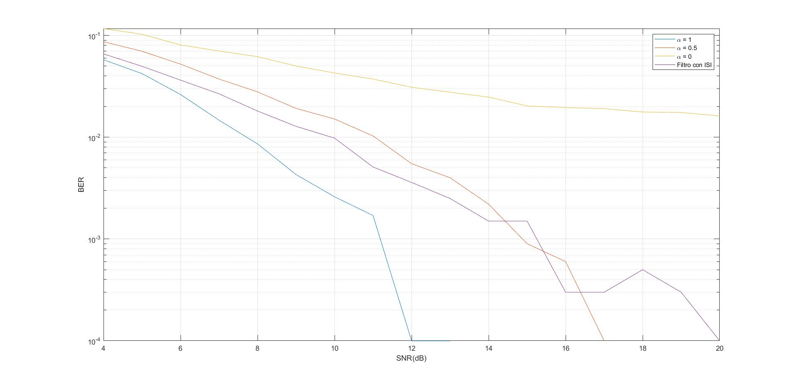

En 

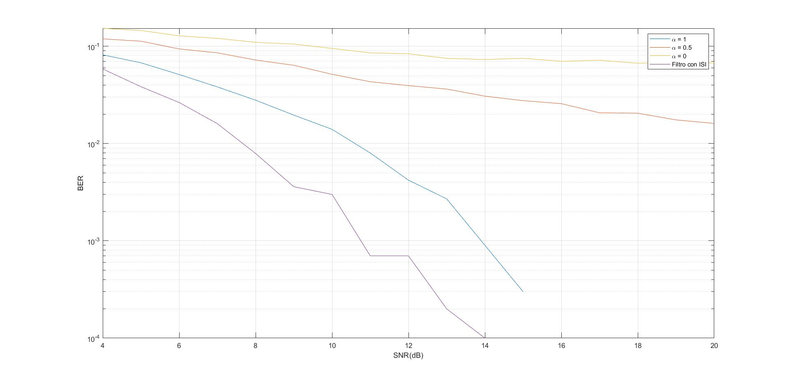
